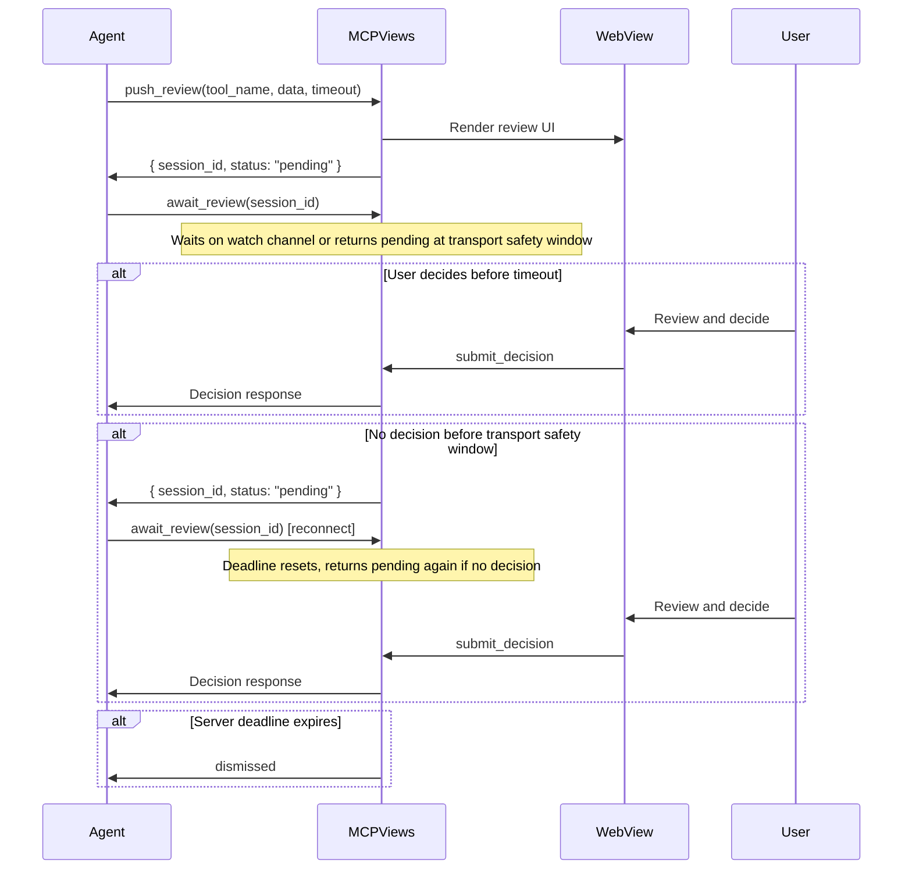
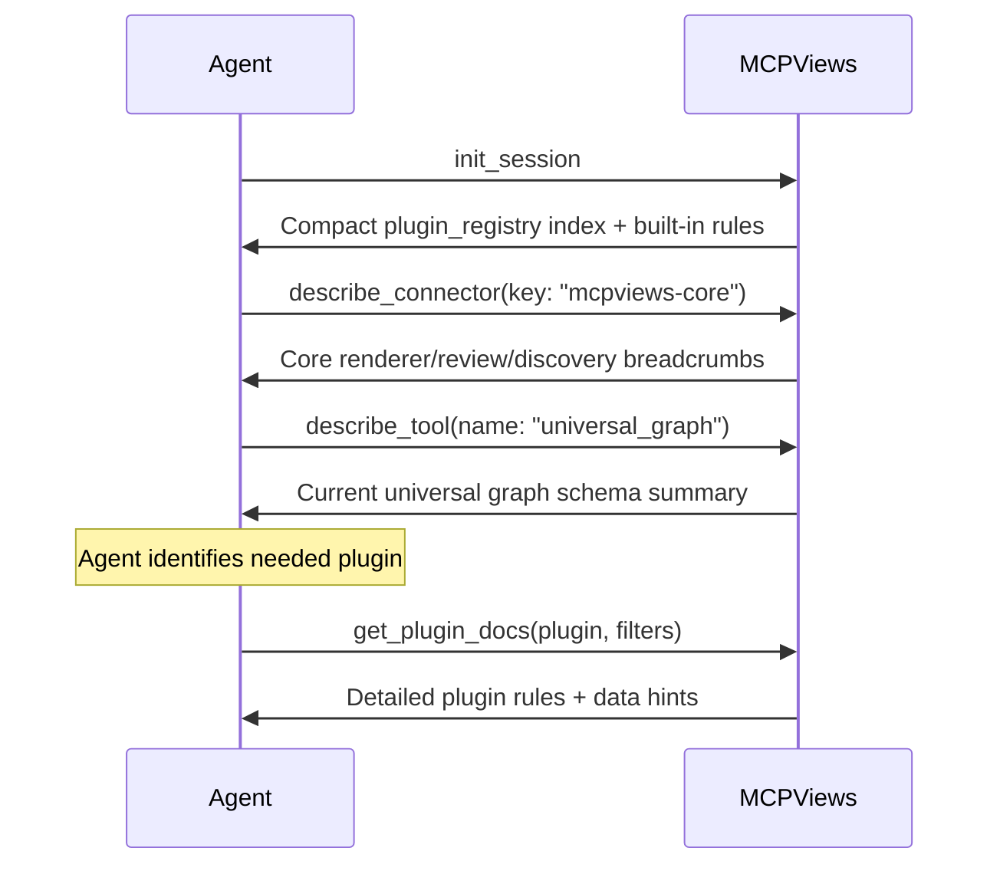

# MCPViews — API Reference

## HTTP Endpoints

### `GET /health`

Returns server status.

**Response** `200 OK`
```json
{
  "version": "0.1.0",
  "port": 4200,
  "uptime_seconds": 123,
  "started_at": "2026-03-25T18:00:00Z"
}
```

### `POST /api/push`

Push content to the viewer. Non-review pushes store a session immediately. For HTTP compatibility, review pushes keep the request open until the user submits a decision or the review deadline expires. MCP agents should prefer the non-blocking `push_review` + `await_review` flow documented below.

**Request Body**
```json
{
  "toolName": "string (required)",
  "toolArgs": {},
  "result": {
    "data": "any (required)",
    "meta": {}
  },
  "reviewRequired": false,
  "timeout": 120,
  "sessionId": "string (optional, auto-generated if absent)"
}
```

**Content Type Resolution**

Content type (renderer name) is resolved by searching all loaded plugin manifest renderer maps for a matching `toolName` key. If a plugin's `renderers` map contains an entry for the given tool name, that mapped renderer name is used as the `contentType`. If no plugin provides a mapping, the raw `toolName` is used as-is. This resolution is performed by `resolve_content_type()` in `http_server.rs`, matching the same logic used by `mcp_tools.rs` for MCP tool calls.

| `toolName` | Content Type | Renderer |
|------------|-------------|----------|
| `rich_content`, `push_to_companion` | `rich_content` | Markdown + mermaid fallback |
| `structured_data` | `structured_data` | Tabular data with hierarchical rows, change tracking, and review mode |
| `universal_graph` | `universal_graph` | Read-only analytical charts and graph packs |
| _(plugin-mapped tool)_ | Renderer name from plugin manifest `renderers` map | Plugin-provided renderer |
| _(anything else)_ | Same as `toolName` | Falls back to `rich_content` if no matching renderer JS found |

**Response (non-review)** `201 Created`
```json
{
  "sessionId": "uuid",
  "status": "stored"
}
```

**Response (review)** `200 OK` or `408 Request Timeout`

`POST /api/push` with `reviewRequired: true` composes the same store + wait steps inside one HTTP request. The request returns when the user decides or the review deadline expires. There is no separate HTTP `/api/await-decision` endpoint. MCP `push_review` is the non-blocking two-step form: it returns a pending `session_id` immediately, and the caller uses MCP `await_review` or `push_check` to wait or poll for the decision.

**Decision responses** (returned by HTTP review pushes or MCP `await_review`):

Accepted:
```json
{
  "sessionId": "uuid",
  "status": "decision_received",
  "decision": "accept"
}
```

Rejected:
```json
{
  "sessionId": "uuid",
  "status": "decision_received",
  "decision": "reject"
}
```

Partial:
```json
{
  "sessionId": "uuid",
  "status": "decision_received",
  "decision": "partial",
  "operationDecisions": {
    "op-1": "accepted",
    "op-2": "rejected"
  },
  "comments": { "op-2": "Needs rewording" },
  "modifications": { "op-1": "Edited text" }
}
```

Timeout (deadline expired with no user action):
```json
{
  "sessionId": "uuid",
  "status": "decision_received",
  "decision": "dismissed"
}
```

### `POST /api/heartbeat`

Reset the review deadline for a pending review session. The frontend calls this periodically to keep a review session alive while the user is actively interacting (scrolling, clicking, typing).

**Request Body**
```json
{
  "session_id": "uuid"
}
```

**Response** `200 OK` if the deadline was reset.

**Error** `400 Bad Request` if `session_id` is missing or body is invalid JSON. `404 Not Found` if no pending review exists for the given session.

### `POST /api/reload-plugins`

Reload all plugins from disk and broadcast `notifications/tools/list_changed` to all active MCP SSE sessions.

**Response** `200 OK` (empty body)

### `GET /mcp`

Open an SSE stream for MCP Streamable HTTP server-to-client notifications.

**Required Headers:**
- `Accept: text/event-stream`

**Optional Headers:**
- `mcp-session-id` — subscribe to an existing session instead of creating a new one

**Response** `200 OK` (SSE stream)
- Response header `mcp-session-id` contains the session ID
- Stream sends JSON-RPC notifications as SSE `data:` events
- Keepalive pings are sent automatically

If `mcp-session-id` is provided and the session exists, the stream subscribes to that session. If the session does not exist, returns `404 Not Found`.

**Error** `406 Not Acceptable` if `Accept` header missing or incorrect. `404 Not Found` if `mcp-session-id` header references a nonexistent session.

### `POST /mcp`

Send a JSON-RPC request to the MCP handler.

**Optional Headers:**
- `mcp-session-id` — bind request to an existing SSE session

**Session Creation from POST:** Streamable HTTP clients may POST an `initialize` request before opening an SSE stream. When no `mcp-session-id` header is present and the request method is `initialize`, the server creates a new session and returns the `mcp-session-id` response header. The client should use this session ID for all subsequent requests and SSE subscriptions.

**Request Body:** JSON-RPC 2.0 request

**Response** JSON-RPC 2.0 response with appropriate status code.
- For standard requests: `200 OK` with JSON-RPC response body
- For notifications (no JSON-RPC response expected): `202 Accepted` with empty body
- If a session was created from an `initialize` POST, the `mcp-session-id` response header is included

**Error** `404 Not Found` if `mcp-session-id` is provided but session does not exist.

### `DELETE /mcp`

Tear down an MCP SSE session.

**Required Headers:**
- `mcp-session-id` — the session to remove

**Response** `200 OK` if session was removed.

**Error** `400 Bad Request` if header missing, `404 Not Found` if session does not exist.

### Mock OAuth Endpoints

MCPViews implements a complete mock OAuth flow so that Claude Code's HTTP transport auth handshake completes instantly without real authentication. These endpoints satisfy the RFC 9728 / RFC 8414 discovery probes and the subsequent registration, authorization, and token exchange.

#### `GET /.well-known/oauth-protected-resource`

RFC 9728 protected resource metadata.

**Response** `200 OK`
```json
{
  "resource": "http://localhost:4200",
  "authorization_servers": ["http://localhost:4200"]
}
```

#### `GET /.well-known/oauth-authorization-server`

RFC 8414 authorization server metadata.

**Response** `200 OK`
```json
{
  "issuer": "http://localhost:4200",
  "authorization_endpoint": "http://localhost:4200/oauth/authorize",
  "token_endpoint": "http://localhost:4200/oauth/token",
  "registration_endpoint": "http://localhost:4200/oauth/register",
  "response_types_supported": ["code"],
  "grant_types_supported": ["authorization_code", "refresh_token"],
  "code_challenge_methods_supported": ["S256"],
  "token_endpoint_auth_methods_supported": ["none"]
}
```

#### `POST /oauth/register`

Dynamic client registration (mock). Echoes back provided `redirect_uris` with a fixed `client_id`.

**Request Body** (JSON, extra fields ignored)
```json
{
  "redirect_uris": ["http://localhost:9999/callback"]
}
```

**Response** `200 OK`
```json
{
  "client_id": "mcpviews-mock-client",
  "client_name": "MCPViews Mock Client",
  "redirect_uris": ["http://localhost:9999/callback"],
  "grant_types": ["authorization_code", "refresh_token"],
  "response_types": ["code"],
  "token_endpoint_auth_method": "none"
}
```

#### `GET /oauth/authorize`

Immediately redirects with a mock authorization code.

**Query Parameters:**
| Param | Required | Description |
|-------|----------|-------------|
| `redirect_uri` | Yes | Client callback URL |
| `state` | No | Opaque state value passed through |

**Response** `302 Found` with `Location: {redirect_uri}?code=mcpviews-mock-code&state={state}`

**Error** `400 Bad Request` if `redirect_uri` is missing.

#### `POST /oauth/token`

Returns a mock access token.

**Response** `200 OK`
```json
{
  "access_token": "mcpviews-mock-token",
  "token_type": "bearer",
  "expires_in": 86400,
  "scope": "mcp"
}
```

### `OPTIONS /api/push`

CORS preflight. Returns `200` with:
- `Access-Control-Allow-Origin: *`
- `Access-Control-Allow-Methods: GET, POST, DELETE, OPTIONS`
- `Access-Control-Allow-Headers: *`
- `Access-Control-Expose-Headers: mcp-session-id`

## Tauri IPC Commands

These are called from the WebView via `window.__TAURI__.core.invoke()`.

### `get_sessions`

Returns all active sessions.

```javascript
const sessions = await invoke('get_sessions');
// Returns: PreviewSession[]
```

### `submit_decision`

Submit a review decision for a session.

```javascript
await invoke('submit_decision', {
  sessionId: 'uuid',
  decision: 'accept',           // 'accept' | 'reject' | 'partial'
  operationDecisions: null,     // Optional: { 'op-id': 'accepted' | 'rejected' }
  comments: null,               // Optional: { 'op-id': 'comment text' }
  modifications: null,          // Optional: { 'op-id': 'modified value' }
  additions: null               // Optional: JSON value
});
```

### `dismiss_session`

Remove a session without making a decision.

```javascript
await invoke('dismiss_session', { sessionId: 'uuid' });
```

### `get_health`

Returns app health info.

```javascript
const health = await invoke('get_health');
// Returns: { version: "0.1.0", status: "ok" }
```

### `list_plugins`

Returns all installed plugins.

```javascript
const plugins = await invoke('list_plugins');
// Returns: PluginInfo[]
// PluginInfo: { name, version, has_mcp, auth_type, auth_configured, tool_count }
```

### `install_plugin`

Install a plugin from a JSON manifest string.

```javascript
await invoke('install_plugin', { manifestJson: '{"name":"...","version":"...","renderers":{}}' });
```

### `uninstall_plugin`

Remove an installed plugin by name.

```javascript
await invoke('uninstall_plugin', { name: 'plugin-name' });
```

### `install_plugin_from_file`

Install a plugin from a local manifest file path.

```javascript
await invoke('install_plugin_from_file', { path: '/path/to/manifest.json' });
```

### `fetch_registry`

Fetch available plugins from the remote registry. Uses 1-hour cache.

```javascript
const entries = await invoke('fetch_registry', { registryUrl: null });
// Returns: RegistryEntry[]
// RegistryEntry: { name, version, description, author, homepage, manifest, tags }
```

### `start_plugin_auth`

Initiate the OAuth browser-redirect flow for an OAuth plugin.

```javascript
const token = await invoke('start_plugin_auth', { pluginName: 'my-plugin' });
// Returns: token string on success
```

### `get_plugin_auth_header`

Retrieve the resolved authentication header for a plugin. Returns the full header value (e.g., `Bearer <token>` or a custom header value). Checks stored tokens first, then environment variable fallbacks, and attempts an OAuth token refresh if the stored token has expired.

```javascript
const header = await invoke('get_plugin_auth_header', { pluginName: 'my-plugin' });
// Returns: "Bearer sk-abc123" (or custom header value)
// Throws: if plugin not found, has no auth config, or no token is available
```

### `store_plugin_token`

Store a Bearer token or API key for a plugin. Saves to `~/.mcpviews/auth/<pluginName>.json`.

```javascript
await invoke('store_plugin_token', { pluginName: 'my-plugin', token: 'sk-abc123' });
```

### `install_plugin_from_registry`

Install a plugin from a registry entry. If the entry has a `download_url`, downloads and extracts the ZIP package. Otherwise falls back to manifest-only install.

```javascript
await invoke('install_plugin_from_registry', { entryJson: '{"name":"...","version":"...","manifest":{...},"download_url":"..."}' });
```

### `install_plugin_from_zip`

Install a plugin from a local ZIP file. The ZIP must contain a `manifest.json` at the root (or under a single top-level directory).

```javascript
await invoke('install_plugin_from_zip', { path: '/path/to/plugin.zip' });
```

### `update_plugin`

Update an installed plugin to the latest version from the cached registry. Downloads the ZIP package if available.

```javascript
await invoke('update_plugin', { name: 'plugin-name' });
```

### `reinstall_plugin`

Reinstall a plugin from the registry. If the plugin exists in the cached registry, it is re-downloaded and installed (replacing the current version). For non-registry (local-only) plugins, the command verifies the plugin exists but does not re-download.

```javascript
await invoke('reinstall_plugin', { name: 'plugin-name' });
```

### `clear_plugin_auth`

Remove the stored authentication token for a plugin. Deletes the token file at `~/.mcpviews/auth/<name>.json`. Returns success even if no token file exists.

```javascript
await invoke('clear_plugin_auth', { name: 'plugin-name' });
```

### `get_plugin_renderers`

Scan installed plugin directories for custom renderer JS files.

```javascript
const renderers = await invoke('get_plugin_renderers');
// Returns: RendererInfo[]
// RendererInfo: { plugin_name, file_name, url, mcp_url, frame_origins }
// url format: plugin://localhost/{plugin_name}/renderers/{file_name}?v={mtime}
// mtime is the file's last-modified Unix timestamp for cache busting
// mcp_url: the plugin's MCP URL from manifest.json (mcp.url field), or null
//          Used by the frontend to populate window.__mcpviews_plugins
// frame_origins: iframe origins from manifest.json, surfaced to renderer JS
```

### `get_renderer_registry`

Returns all invocable renderer definitions (those with `invoke_schema` set). Used by the frontend invocation registry to populate the cross-renderer linking system.

```javascript
const renderers = await invoke('get_renderer_registry');
// Returns: RendererRegistryEntry[]
// RendererRegistryEntry: { name, description, display_mode, invoke_schema, url_patterns, plugin }
```

Each entry includes the renderer's preferred `display_mode` ("drawer", "modal", or "replace"), the `invoke_schema` (JSON schema hint for invocation params), `url_patterns` (glob patterns for auto-detecting URLs), and the `plugin` name that provides it. Only renderers with `invoke_schema` set are included.

### `get_registry_sources`

Get all configured registry sources.

```javascript
const sources = await invoke('get_registry_sources');
// Returns: RegistrySource[]
// RegistrySource: { name, url, enabled }
```

### `add_registry_source`

Add a new registry source. Errors if a source with the same URL already exists.

```javascript
await invoke('add_registry_source', { name: 'My Registry', url: 'https://example.com/registry.json' });
```

### `remove_registry_source`

Remove a registry source by URL.

```javascript
await invoke('remove_registry_source', { url: 'https://example.com/registry.json' });
```

### `toggle_registry_source`

Toggle a registry source's enabled state.

```javascript
await invoke('toggle_registry_source', { url: 'https://example.com/registry.json' });
```

### `set_plugin_update_policy`

Set the update policy for a plugin. Persists to `~/.mcpviews/plugins/{plugin-name}/preferences.json`.

```javascript
await invoke('set_plugin_update_policy', { pluginName: 'my-plugin', policy: 'always' });
// policy: 'always' (auto-update), 'ask' (prompt each time), 'skip' (skip updates)
```

### `get_plugin_update_policy`

Get the current update policy for a plugin. Returns `"ask"` if no preference has been set.

```javascript
const policy = await invoke('get_plugin_update_policy', { pluginName: 'my-plugin' });
// Returns: 'always' | 'ask' | 'skip'
```

### `get_settings`

Read the application settings from `~/.mcpviews/config.json`. Returns default (empty) settings if no config file exists or the file cannot be parsed.

```javascript
const settings = await invoke('get_settings');
// Returns: Settings
// Settings: { registry_url?: string, registry_sources?: RegistrySource[] }
```

### `save_settings`

Write application settings to `~/.mcpviews/config.json`. Accepts a typed `Settings` object. Creates the config directory and file if they do not exist. Empty/null fields are omitted from the saved JSON.

```javascript
await invoke('save_settings', {
  settings: {
    registry_sources: [
      { name: 'Default', url: 'https://example.com/registry.json', enabled: true }
    ]
  }
});
```

## MCP Tools

These tools are exposed via the MCP Streamable HTTP transport (`POST /mcp` with `tools/call`).

### `push_content`

Display content in the MCPViews window. Supports multiple content types.

**Parameters:**
| Field | Type | Required | Description |
|-------|------|----------|-------------|
| `tool_name` | string | Yes | Content type identifier for renderer selection. Available renderers are listed dynamically based on installed plugins. Use `rich_content` for generic markdown display. |
| `data` | object | Yes | Content data to display. |

### `register_dataset`

Register compact inline seed data or allowlisted local Markdown references in MCPViews' session-scoped cache. Use the returned `dataset_id` and `query_token` in renderer `dataRef` payloads to reduce repeated output tokens for large tables and graph rows. V1 is an output-token optimization only; it does not ingest SQL, APIs, Excel, CSV files, or MCP tool results by itself.

**Parameters:**
| Field | Type | Required | Description |
|-------|------|----------|-------------|
| `dataset_id` | string | No | Stable dataset id. MCPViews generates one if omitted. |
| `title` | string | No | Human-readable dataset title. |
| `columns` / `rows` | array | No | Top-level inline seed data. |
| `tables` | array | No | Structured-data tables to register as sources. |
| `graphs` | array | No | Universal-graph specs whose `data.columns` and `data.rows` should be registered as sources. |
| `sources` | array | No | Source objects with `id`, `columns`, `rows`, `table`, `graph`, or allowlisted local Markdown references. Pass objects directly, not stringified JSON. |
| `ttl_seconds` | integer | No | Session-cache TTL. Defaults to 30 minutes. |

**Inline example:**
```json
{
  "dataset_id": "northstar-risk-control-2026-05",
  "sources": [{
    "id": "rule_evaluations",
    "columns": [
      { "id": "rule", "name": "Rule" },
      { "id": "riskScore", "name": "Risk Score", "type": "number" }
    ],
    "rows": [
      { "rule": "Sector cap", "riskScore": 4 },
      { "rule": "Sector cap", "riskScore": 7 }
    ]
  }]
}
```

**Local Markdown reference example:**

Local Markdown reference paths must resolve under `~/.mcpviews/cache/dataset-references` or one of the trusted directories in `MCPVIEWS_DATASET_REFERENCE_ROOTS`.

```json
{
  "dataset_id": "northstar-risk-control-2026-05",
  "sources": [
    {
      "kind": "markdown_json_blocks",
      "path": "/Users/example/.mcpviews/cache/dataset-references/prepared-findings.md"
    },
    {
      "id": "recommended_evidence_reviews",
      "kind": "markdown_table",
      "path": "/Users/example/.mcpviews/cache/dataset-references/prepared-findings.md",
      "heading": "Recommended Evidence Reviews"
    }
  ]
}
```

`markdown_json_blocks` registers each fenced `json` block under its nearest Markdown heading, using heading-derived source ids such as `source_fact_compression`. `markdown_table` registers the Markdown table under the requested `heading`.

The response includes `dataset_id`, `query_token`, source ids, inferred schema summaries, row counts, content hashes, and warnings. If a caller accidentally passes a `sources[]` entry as a stringified JSON object, MCPViews parses it and returns a warning so the agent does not need to emit the same dataset a second time. Every renderer `dataRef` must include the returned `query_token`; `/api/datasets/query` rejects missing or invalid tokens.

### `push_review`

Display content for user review. Returns immediately with a `session_id` and `"pending"` status. The agent then calls `await_review(session_id)` to wait until the user submits their decision.

Visible review targets must use the document or entity's human-readable name, title, path, or display label. Do not make users approve rows or suggestions whose only visible target is an opaque backend ID; keep IDs in stable row identifiers, metadata, or execution context used after approval.

**Parameters:**
| Field | Type | Required | Description |
|-------|------|----------|-------------|
| `tool_name` | string | Yes | Content type identifier for renderer selection. |
| `data` | object | Yes | Content data to display. |
| `timeout` | number | No | Timeout in seconds (default: 120). |

**Response:**
```json
{
  "session_id": "uuid",
  "status": "pending",
  "message": "Review is displayed in the companion window. Call await_review with this session_id to wait for the user's decision."
}
```

The following diagram shows the two-step `push_review` + `await_review` flow, including pending returns before transport timeout.



### `await_review`

Wait for a user decision for a pending review session. If no decision arrives before the MCP transport safety window, `await_review` returns a pending status before the longer review deadline expires; call `await_review` again with the same `session_id`, or use `push_check` for a non-blocking poll. If a previous wait received the decision internally but the response was lost to the caller, retrying `await_review` returns the stored decision payload from the preview session while that session remains in memory.

**Parameters:**
| Field | Type | Required | Description |
|-------|------|----------|-------------|
| `session_id` | string | Yes | The session ID returned by `push_review`. |

**Response:** The user's decision (same shape as the decision responses documented under `POST /api/push`) or a pending status when the transport safety wait elapses before the user decides.

```json
{
  "session_id": "uuid",
  "status": "pending",
  "review_required": true,
  "message": "Review is still pending. Call await_review again with the same session_id, or use push_check for a non-blocking status check."
}
```

#### structured_data renderer

**Read-only display (push_content):**

```json
{
  "tool_name": "structured_data",
  "data": {
    "title": "Optional Title",
    "tables": [{
      "id": "t1",
      "name": "Table Name",
      "columns": [
        { "id": "c1", "name": "Column Name", "change": null }
      ],
      "rows": [{
        "id": "r1",
        "cells": { "c1": { "value": "cell value", "change": null } },
        "children": []
      }]
    }]
  }
}
```

All `change` fields must be `null` for push_content. The server strips non-null change values automatically.

**Reference-backed table:**

```json
{
  "tool_name": "structured_data",
  "data": {
    "title": "Evidence Reviews",
    "tables": [{
      "id": "evidence_reviews",
      "name": "Evidence Reviews",
      "dataRef": {
        "dataset_id": "northstar-risk-control-2026-05",
        "query_token": "returned-query-token",
        "source_id": "reviews",
        "recipe": "review_rows"
      }
    }]
  }
}
```

**Change review (push_review):**

Use human-readable names, titles, paths, or display labels in visible cells for the objects being changed. Row `id` values can remain stable internal keys for decision mapping, but the visible review table should not rely on opaque document/entity IDs as the user's only target context.

```json
{
  "tool_name": "structured_data",
  "data": {
    "title": "Review Title",
    "tables": [{
      "id": "t1",
      "name": "Table Name",
      "columns": [
        { "id": "c1", "name": "Existing Col", "change": null },
        { "id": "c2", "name": "New Col", "change": "add" }
      ],
      "rows": [{
        "id": "r1",
        "cells": {
          "c1": { "value": "updated value", "change": "update" },
          "c2": { "value": "new value", "change": "add" }
        },
        "children": []
      }]
    }]
  },
  "timeout": 300
}
```

Change values: `"add"` (green highlight), `"delete"` (red strikethrough), `"update"` (yellow highlight), `null` (unchanged).

**await_review response (structured_data):**

After calling `push_review` to display the structured data review and `await_review(session_id)` to wait for the user's decision:

```json
{
  "sessionId": "uuid",
  "status": "decision_received",
  "decision": "partial",
  "operationDecisions": {
    "r1": "accept",
    "col:c2": "reject"
  },
  "modifications": {
    "r1.c1": "{\"value\":\"user changed this\",\"user_edited\":true}"
  },
  "additions": {
    "user_edits": { "r1.c1": "user changed this" }
  }
}
```

- `operationDecisions`: Row IDs map to "accept"/"reject". Column decisions use `"col:<colId>"` prefix.
- `modifications`: Cell edits as `"<rowId>.<colId>"` keys with JSON-encoded value objects.
- `additions.user_edits`: Convenience map of user-edited cell values.

#### universal_graph renderer

`universal_graph` is a built-in read-only renderer for analytical charts, hierarchies, networks, flows, timelines, matrices, and distributions. Use it when the main output is visual analysis rather than prose or a review table. Connected agents should call `describe_tool` with `name: "universal_graph"` before constructing complex graph packs, because that hosted breadcrumb description carries the current schema summary.

**Standalone display via `push_content` compatibility wrapper:**

```json
{
  "tool_name": "universal_graph",
  "data": {
    "title": "Revenue Trend",
    "description": "Monthly revenue for the current plan.",
    "graphs": [{
      "id": "revenue_by_month",
      "title": "Revenue by Month",
      "type": "line",
      "data": {
        "columns": [
          { "id": "month", "name": "Month", "type": "date" },
          { "id": "revenue", "name": "Revenue", "type": "number" }
        ],
        "rows": [
          { "month": "2026-01", "revenue": 120000 },
          { "month": "2026-02", "revenue": 142000 }
        ]
      },
      "encoding": { "x": "month", "y": "revenue" }
    }]
  }
}
```

**Direct `universal_graph` tool call:**

Prefer the direct tool when it is available in the agent's tool list. Use the same graph payload at the top level, without the `tool_name`/`data` wrapper:

```json
{
  "title": "Revenue Trend",
  "description": "Monthly revenue for the current plan.",
  "graphs": [{
    "id": "revenue_by_month",
    "title": "Revenue by Month",
    "type": "line",
    "data": {
      "columns": [
        { "id": "month", "name": "Month", "type": "date" },
        { "id": "revenue", "name": "Revenue", "type": "number" }
      ],
      "rows": [
        { "month": "2026-01", "revenue": 120000 },
        { "month": "2026-02", "revenue": 142000 }
      ]
    },
    "encoding": { "x": "month", "y": "revenue" },
    "axes": {
      "x": { "label": "Month", "description": "Calendar month at period end" },
      "y": "Revenue in dollars"
    }
  }]
}
```

Supported V1 graph types: `line`, `area`, `bar`, `stacked_bar`, `grouped_bar`, `scatter`, `bubble`, `combo`, `histogram`, `boxplot`, `heatmap`, `matrix`, `pie`, `donut`, `waterfall`, `funnel`, `gauge`, `radar`, `candlestick`, `timeline`, `gantt`, `tree`, `network`, `treemap`, `sunburst`, and `sankey`.

Graph specs are strictly validated before new pushes are stored: graph IDs must be unique, graph types must be supported, required encodings must be present, supported options must be well-formed, every encoding field must reference an existing `data.columns[].id`, and required numeric/time row values must be valid. Stored or legacy payloads that reach the renderer are handled best-effort with visible graph warnings.

Graphs can use `dataRef` instead of inline `data.columns` and `data.rows` when the source has been registered with `register_dataset`:

```json
{
  "id": "risk_by_rule",
  "title": "Risk By Rule",
  "type": "bar",
  "dataRef": {
    "dataset_id": "northstar-risk-control-2026-05",
    "query_token": "returned-query-token",
    "source_id": "rule_evaluations",
    "recipe": "group_sum",
    "params": { "groupBy": "rule", "value": "riskScore" }
  },
  "encoding": { "x": "rule", "y": "value" }
}
```

Supported `dataRef.recipe` values are `select_rows`, `review_rows`, `count_by`, `group_sum`, `trend`, `heatmap_by_pair`, `funnel_from_counts`, and `waterfall_from_deltas`. The renderer fetches graph/table rows from the session cache and loads graph source rows on demand from the Data button. Every `dataRef` must include the `query_token` returned by `register_dataset`.

For graph `dataRef` recipes, MCPViews derives common recipe params from the graph `encoding` when `dataRef.params` is omitted. For example, `heatmap_by_pair` uses `encoding.x`, `encoding.y`, and `encoding.value`; `waterfall_from_deltas` uses `encoding.x` or `encoding.label` plus `encoding.value`; `funnel_from_counts` uses `encoding.label` plus `encoding.value`; and `group_sum` derives `outputField` from the visible y/value encoding so hydrated rows match the graph. Pass explicit `params` only when the transform should differ from the visible encoding.

Optional per-graph `options`:

```json
{
  "options": {
    "xScale": "auto",
    "yScale": "auto",
    "maxVisibleItems": 24,
    "showAll": false,
    "otherBucket": "separate",
    "binCount": 12,
    "showTotal": true,
    "totalLabel": "Ending total"
  }
}
```

`xScale`/`yScale` support `auto`, `category`, `linear`, or `time`. `showAll` renders all marks, but labels may still be sampled or culled to avoid overlap. `otherBucket` supports `separate` (default), `inline`, or `hidden` for dense categorical summaries. `binCount` controls histogram bins and is clamped by the renderer to a safe range. Waterfall charts also support `showTotal: false` to omit the ending balance bar and `totalLabel` to name that ending balance.

Optional per-graph `axes` can provide visible axis context:

```json
{
  "axes": {
    "x": { "label": "Customer segment", "description": "Commercial segment assigned in CRM" },
    "y": "ARR movement in thousands of dollars"
  }
}
```

Each axis can be a string label or an object with `label` and optional `description`. When omitted, supported charts derive axis titles from encoded column names.

Optional per-graph `role` can be `primary` (default) or `drilldown`. Drilldown graphs are hidden from the initial graph list but can be opened by interactions from a primary graph. Optional `interactions` support read-only exploration: `details` selects fields for visible hover and pinned detail panels, `hover` controls highlight behavior, `drilldowns[]` maps a clicked mark/node/link value to a target graph field, and `metricControls` lets the user swap `encoding.y` or `encoding.value` among validated numeric fields.

```json
{
  "role": "primary",
  "interactions": {
    "details": { "titleField": "segment", "fields": ["segment", "revenue", "retention"] },
    "hover": "auto",
    "drilldowns": [{
      "id": "segment_detail",
      "label": "Open segment detail",
      "targetGraphId": "segment_detail_graph",
      "trigger": "mark",
      "match": { "source": "segment", "targetField": "segment" }
    }],
    "metricControls": { "target": "y", "fields": ["revenue", "retention"] }
  }
}
```

Dense graphs auto-summarize by default with visible disclosure: sampled ticks, top-N categories with a separated Other callout, capped timeline/funnel rows, duplicate candlestick/time-key aggregation, duplicate network/sankey link aggregation, and source-table truncation notices. Very dense scatter/bubble, heatmap/matrix, network, and sankey views render compact native layers with sampled focus marks so all visual marks remain represented without creating thousands of DOM nodes. Scatter and bubble charts use numeric/time x-positioning when the x column supports it. Bar, heatmap, and waterfall charts render numeric labels when there is enough room, while compact axis labels preserve full values in tooltips/source data. Histograms label numeric ranges and render a single meaningful bin for zero-variance data. Gauges can read `encoding.min`/`encoding.max` fields, falling back to `graph.min`/`graph.max`, and display under-limit or over-limit values with clamped arcs. Waterfalls treat the first row and optional ending row as balance bars, color intermediate decreases/increases separately, and connect cumulative movements. Funnels preserve a uniform side slope while using vertical stage thickness to encode relative value; exact values remain available in labels, tooltips, pinned details, and source rows. Tree and sunburst hierarchy traversal is cycle-safe and stack-safe; extremely deep sunbursts disclose compressed thin rings. Sunburst uses `encoding.parent` when supplied and falls back to donut only when no hierarchy exists. Sankey data with cycles or self-links falls back to network rendering with a warning.

**Embedded in rich_content or rich_content review payloads:**

````json
{
  "tool_name": "rich_content",
  "data": {
    "title": "Revenue Plan",
    "body": "Here is the trend.\n\n```universal_graph:revenue_by_month\n```",
    "graphs": [{
      "id": "revenue_by_month",
      "title": "Revenue by Month",
      "type": "line",
      "data": {
        "columns": [
          { "id": "month", "name": "Month" },
          { "id": "revenue", "name": "Revenue" }
        ],
        "rows": [{ "month": "Jan", "revenue": 10 }]
      },
      "encoding": { "x": "month", "y": "revenue" }
    }]
  }
}
````

The fenced `universal_graph:<graph-id>` block must be empty and must reference a matching graph in `data.graphs`. Graph embeds are read-only context in review surfaces; approve/reject state still belongs to suggestions and structured_data tables.

### `push_check`

Non-blocking status check for a review session. Returns the current status without waiting. Use `await_review` to wait until a decision is submitted. Once a review is decided, the response also includes the stored decision details (`operation_decisions`, `comments`, `modifications`, `additions`, `suggestion_decisions`, and `table_decisions`) when present.

**Parameters:**
| Field | Type | Required | Description |
|-------|------|----------|-------------|
| `session_id` | string | Yes | The session ID returned by `push_review`. |

### `init_session`

Initialize MCPViews for the current session. Returns runtime breadcrumbs, plugin auth status, hosted discovery, and startup-rule reconciliation actions. Must be called at the start of every conversation, chat session, or interaction -- not just once. Pass `project_path` so startup rules can be evaluated against the project ledger.

The following diagram shows the two-tier lazy-loading approach for plugin documentation plus hosted breadcrumb discovery for core renderer tools.



**Parameters:**
| Field | Type | Required | Description |
|-------|------|----------|-------------|
| `agent_type` | string | No | The agent platform calling this tool. Supported: `claude_code`, `claude_desktop`, `codex`, `cursor`, `windsurf`, `opencode`, `antigravity`. Tailors startup-rule installation instructions. |
| `project_path` | string | No | Absolute path to the current project root. When supplied, MCPViews creates/loads `<project_path>/mcpviews-init.json` and returns `startup_rule_actions` for core and plugin startup rule reconciliation. |

**Response:**
```json
{
  "rules": [
    {
      "name": "renderer_selection",
      "category": "system",
      "source": "built-in",
      "rule": "When displaying content in MCPViews, choose the renderer based on data shape..."
    },
    {
      "name": "bulk_action_review",
      "category": "system",
      "source": "built-in",
      "rule": "Use push_review for MCP mutations only when review adds meaningful safety or control..."
    },
    {
      "name": "rich_content_usage",
      "category": "renderer",
      "source": "built-in",
      "renderer": "rich_content",
      "description": "Universal markdown display with mermaid diagrams",
      "scope": "universal",
      "data_hint": "{ \"title\": \"heading\", \"body\": \"markdown\" }",
      "tools": [],
      "rule": "When presenting implementation plans..."
    }
  ],
  "rules_version": "24",
  "plugin_status": [
    {
      "plugin": "my-plugin",
      "auth_type": "OAuth",
      "auth_configured": false,
      "auth_url": "https://...",
      "message": "Plugin 'my-plugin' requires re-authentication..."
    }
  ],
  "persistence_instructions": "Install/update only startup rules returned in startup_rule_actions...",
  "plugin_registry": [
    {
      "name": "my-plugin",
      "summary": "my-plugin plugin",
      "tags": ["search-results", "code-units"],
      "tool_groups": [
        {
          "name": "Search Results",
          "hint": "Search the codebase for matching code snippets...",
          "tools": ["search_codebase", "vector_search"]
        }
      ],
      "renderers": ["search_results", "code_units"],
      "plugin_rules": ["Always prefer vector search for semantic queries"]
    }
  ],
  "plugin_updates": [
    {
      "name": "my-plugin",
      "installed_version": "1.0.0",
      "available_version": "1.2.0"
    }
  ],
  "plugin_update_actions": {
    "auto_update": [
      { "name": "auto-plugin", "from": "1.0.0", "to": "1.1.0" }
    ],
    "ask_user": [
      { "name": "my-plugin", "from": "1.0.0", "to": "1.2.0" }
    ],
    "instruction": "For plugins in auto_update: call update_plugins immediately..."
  },
  "startup_rule_actions": {
    "status": "needs_install",
    "project_path": "/path/to/project",
    "config_path": "/path/to/project/mcpviews-init.json",
    "needs_install": [
      {
        "key": "mcpviews-core:init_session_project_path",
        "plugin": "mcpviews-core",
        "rule_id": "init_session_project_path",
        "title": "MCPViews Session Init",
        "rule_version": "1",
        "rule_hash": "sha256:...",
        "rule": "At the start of every new agent session..."
      }
    ],
    "auto_update": [],
    "suppressed": [],
    "current": [],
    "orphaned": [],
    "native_rule_file": "AGENTS.md",
    "native_rule_file_path": "/path/to/project/AGENTS.md",
    "codex_rule_file_context": {
      "target_rule_file": "/path/to/project/AGENTS.md",
      "warnings": []
    },
    "native_rule_block": "## MCPViews Startup Rules\n\n<!-- mcpviews-startup-rules-schema: 1 -->\n...",
    "instruction": "Install or update only startup_rule_actions.needs_install and startup_rule_actions.auto_update..."
  },
  "rules_update": {
    "current_version": "24",
    "instruction": "Runtime MCPViews rules are session breadcrumbs only. Do not persist the rules array..."
  }
}
```

The `rules` array now contains built-in (universal) rules -- the `renderer_selection` and `bulk_action_review` system rules, plus rules for universal-scope renderers -- and saved setup preference rules for installed plugins. Plugin-specific rules are fetched on-demand via `get_plugin_docs`.

The `rules_version` string tracks the current runtime breadcrumb set. Runtime `rules`, `plugin_rules`, renderer rules, DecidR/Ludflow workflow guidance, setup questions, plugin docs, and tool docs must not be written into native startup rule files. Native rule files should contain only explicit `startup_rules` returned through `startup_rule_actions`.

The `plugin_registry` array is a compact index of installed plugins, listing their tool groups, renderer names, tags, legacy global `plugin_rules`, and structured plugin rules marked `always_include`. Agents use this to identify which plugin to query for detailed docs, then call `get_plugin_docs` with the plugin name and optional filters. Built-in renderer tools are also exposed through the hosted breadcrumb catalog; use `describe_connector` with key `mcpviews-core`, then `describe_tool` or `describe_tool_group` for direct renderer guidance.

The `plugin_updates` array lists plugins that have newer versions available in the registry. Each entry includes the plugin name, installed version, and available version. Call `update_plugins` to apply updates.

The `plugin_update_actions` object evaluates each pending update against the plugin's stored update preferences (from `preferences.json`). Plugins with `"always"` policy go into `auto_update` (proceed immediately); plugins with `"ask"` policy go into `ask_user` (prompt user for consent); plugins with `"skip"` policy for the specific available version are excluded from both lists. The `instruction` field guides the agent on how to handle each category.

The `startup_rule_actions` object evaluates MCPViews core startup rules plus plugin `startup_rules` against project-local `mcpviews-init.json` only when `project_path` is provided. `needs_install` rules should be installed through the current agent's native project rule mechanism, then recorded with `save_startup_rule_state`. `auto_update` rules are stale installed rules that can be updated unless the project state has `do_not_update`. `suppressed` includes declined installs/updates and setup-answer-suppressed rules. `orphaned` reports ledger entries that no current startup rule returns, such as old split Gronk mode/scope keys. When `project_path` is omitted, `status` is `project_path_required` and the agent should rerun init/setup with `project_path` before treating startup rules as reconciled. For Codex-style agents, `native_rule_file_path` is the exact `AGENTS.md` target for the supplied project root, and `codex_rule_file_context.warnings` flags parent-only or nested `AGENTS.md` situations where startup rules may not load in fresh sessions.

### `get_plugin_docs`

Fetch detailed usage docs for a plugin's tools and renderers. Call after `init_session` identifies which plugin you need. Returns plugin-specific renderer rules, tool rules, global plugin breadcrumbs, and matching structured plugin breadcrumbs, optionally filtered by group, tool, or renderer name.

**Parameters:**
| Field | Type | Required | Description |
|-------|------|----------|-------------|
| `plugin` | string | Yes | Plugin name (e.g., `"decidr"`, `"my-plugin"`). |
| `groups` | string[] | No | Specific tool group names to fetch (e.g., `["Search", "Code Analysis"]`). Group names come from `plugin_registry[].tool_groups[].name` in the `init_session` response. |
| `tools` | string[] | No | Specific tool names to fetch, unprefixed (e.g., `["search_codebase"]`). |
| `renderers` | string[] | No | Specific renderer names to fetch (e.g., `["code_units", "search_results"]`). |

When `groups` is provided, the group names are expanded to their constituent tool names. When multiple filters are provided, their tool sets are merged. When no filters are provided, all plugin rules are returned.

**Response:**
```json
{
  "plugin": "my-plugin",
  "rules": [
    {
      "name": "search_results_usage",
      "category": "renderer",
      "source": "plugin",
      "renderer": "search_results",
      "description": "Search output",
      "scope": "tool",
      "data_hint": "{ results: [...] }",
      "tools": ["search_codebase"]
    },
    {
      "name": "tp__search_codebase_usage",
      "category": "tool",
      "source": "my-plugin",
      "tool": "tp__search_codebase",
      "rule": "Use search for queries."
    }
  ]
}
```

### `update_plugins`

Update installed plugins to their latest versions from the registry. Uses remote manifest resolution to discover available updates. If no plugin name is provided, updates all plugins with available updates.

**Parameters:**
| Field | Type | Required | Description |
|-------|------|----------|-------------|
| `plugin_name` | string | No | Specific plugin to update. If omitted, updates all plugins with available updates. |

**Response:**
```json
{
  "updated": [
    {
      "plugin": "my-plugin",
      "from": "1.0.0",
      "to": "1.2.0",
      "status": "success"
    }
  ]
}
```

### `save_update_preference`

Save the user's update preference for a plugin after asking them about a pending update. Used by agents during the consent flow when `init_session` returns plugins in the `plugin_update_actions.ask_user` list.

**Parameters:**
| Field | Type | Required | Description |
|-------|------|----------|-------------|
| `plugin` | string | Yes | Plugin name. |
| `policy` | string | Yes | Update policy: `"once"` (update this time only, revert to ask), `"always"` (auto-update going forward), `"skip"` (skip this specific version). |
| `version` | string | Yes | The version this preference applies to. |

**Response:**
```json
{
  "content": [{
    "type": "text",
    "text": "{ \"status\": \"saved\", \"plugin\": \"my-plugin\", \"policy\": \"always\", \"message\": \"Auto-update enabled for 'my-plugin'. Proceed with update_plugins, then call mcpviews_setup with project_path to reconcile startup_rule_actions.\" }"
  }]
}
```

**Policy behavior:**
- `"once"` — Saves policy as `"ask"` (so next update will prompt again). Agent should proceed with `update_plugins`.
- `"always"` — Saves policy as `"always"`. Future updates for this plugin will appear in `auto_update` instead of `ask_user`. Agent should proceed with `update_plugins`.
- `"skip"` — Saves policy as `"skip"` with the specific version. This version will not appear in future `plugin_update_actions`. A newer version beyond the skipped one will re-prompt.

### `save_setup_preference`

Save the user's selected answer for an installed plugin setup question. Used by agents after `mcpviews_setup` returns `setup_questions` and the user chooses one option. The caller passes only the plugin name, setup question id, and selected option value; MCPViews validates those against the installed manifest and persists the manifest-defined `persisted_rule`.

**Parameters:**
| Field | Type | Required | Description |
|-------|------|----------|-------------|
| `plugin` | string | Yes | Installed plugin name. |
| `question_id` | string | Yes | Stable setup question id from the plugin manifest. |
| `value` | string | Yes | Selected option value from the setup question. |

**Behavior:**
- Rejects unknown plugins, unknown setup questions, unknown option values, and options without `persisted_rule`.
- Stores the selected value and selected rule snapshot in `~/.mcpviews/plugins/{plugin-name}/preferences.json`.
- Future `init_session` calls include the saved setup rule while the plugin remains installed.
- `mcpviews_setup` skips already answered setup questions by default, so users are not asked the same question every setup run.
- Agent-native rule files may mirror the selected rule for compatibility, but the MCPViews preference store is the product source of truth.

**Response:**
```json
{
  "content": [{
    "type": "text",
    "text": "{ \"status\": \"saved\", \"plugin\": \"my-plugin\", \"question_id\": \"mode\", \"value\": \"full\", \"persist_as_rule_name\": \"my_plugin_mode\", \"message\": \"Setup preference saved...\" }"
  }]
}
```

### `save_startup_rule_state`

Record project-local startup rule state after an agent installs, updates, or declines a plugin startup rule. MCPViews writes only `<project_path>/mcpviews-init.json`; it does not write `AGENTS.md`, `.claude/rules`, `.cursor/rules`, `.windsurfrules`, or any other agent-native rule file.

**Parameters:**
| Field | Type | Required | Description |
|-------|------|----------|-------------|
| `project_path` | string | Yes | Absolute path to the project root containing `mcpviews-init.json`. |
| `plugin` | string | Yes | Plugin name that owns the startup rule. |
| `rule_id` | string | Yes | Startup rule id from the plugin manifest. |
| `rule_version` | string | Yes | Startup rule version returned in `startup_rule_actions`. |
| `rule_hash` | string | Yes | Startup rule hash returned in `startup_rule_actions`. |
| `locations` | array | No | Agent-native rule file locations that were updated, each with `agent_type`, `path`, and `label`. |
| `do_not_install` | boolean | No | Set true when the user declined installing a missing rule. MCPViews will not ask again until this project state is explicitly changed. |
| `do_not_update` | boolean | No | Set true when the user declined updating an installed stale rule. |

**Response:**
```json
{
  "content": [{
    "type": "text",
    "text": "{ \"status\": \"saved\", \"key\": \"plugin-name:rule-id\", \"message\": \"Startup rule state saved...\" }"
  }]
}
```

### `mcpviews_install_plugin`

Install a plugin into MCPViews programmatically. Accepts a plugin manifest as JSON and optionally a download URL for a ZIP package containing renderer assets. If a plugin with the same name already exists, it is replaced. After installation, connected MCP clients are notified via `notifications/tools/list_changed` and the GUI receives a `reload_renderers` event.

**Parameters:**
| Field | Type | Required | Description |
|-------|------|----------|-------------|
| `manifest_json` | string | Yes | JSON string of a `PluginManifest` object defining the plugin's name, version, renderers, MCP config, and tool rules. |
| `download_url` | string | No | URL to a `.zip` package to download and install. If provided, the manifest is extracted from the package and the `manifest_json` parameter is not used. |

**Response:**
```json
{
  "content": [{
    "type": "text",
    "text": "Plugin 'my-plugin' installed successfully."
  }]
}
```

**Behavior:**
- **Manifest-only install** (no `download_url`): Parses `manifest_json` and registers the plugin in the in-memory registry.
- **ZIP install** (with `download_url`): Downloads the ZIP package, extracts it to `~/.mcpviews/plugins/{plugin-name}/`, and registers the extracted manifest.
- If a plugin with the same name is already installed, it is removed first and then re-added.
- After installation, a `notifications/tools/list_changed` notification is broadcast to all MCP SSE sessions and a `reload_renderers` event is emitted to the WebView.

### `list_registry`

List all available plugins from the MCPViews registry, including install status, auth status, and available updates. Useful for guided plugin discovery workflows.

**Parameters:**
| Field | Type | Required | Description |
|-------|------|----------|-------------|
| `tag` | string | No | Optional filter: only return plugins matching this tag. |

**Response:**
```json
{
  "content": [{
    "type": "text",
    "text": "{ \"plugins\": [...], \"total\": 3 }"
  }]
}
```

Each plugin entry includes:
| Field | Type | Description |
|-------|------|-------------|
| `name` | string | Plugin name. |
| `description` | string | Plugin description. |
| `version` | string | Registry version. |
| `author` | string | Author name. |
| `tags` | string[] | Plugin tags. |
| `download_url` | string | ZIP download URL. |
| `installed` | boolean | Whether the plugin is currently installed. |
| `installed_version` | string | Installed version (if installed). |
| `auth_type` | string | Auth type ("OAuth", "Bearer", "ApiKey") if installed. |
| `auth_configured` | boolean | Whether auth is configured (only true if installed). |
| `update_available` | string | Newer version string if an update exists. |

### `start_plugin_auth`

Start authentication for an installed plugin. For OAuth plugins, this opens the user's browser and waits for the redirect flow to complete. For Bearer/ApiKey plugins, this checks whether the required environment variable is set.

**Parameters:**
| Field | Type | Required | Description |
|-------|------|----------|-------------|
| `plugin_name` | string | Yes | Name of the plugin to authenticate. |

**Response (success):**
```json
{
  "content": [{
    "type": "text",
    "text": "OAuth authentication for 'my-plugin' completed successfully."
  }]
}
```

**Error:** Returns an error string if the environment variable is not set (Bearer/ApiKey) or the OAuth flow fails.

### `get_plugin_prompt`

Fetch a prompt from a plugin. Returns the prompt content with optional template argument substitution. The returned content should be used as system instructions for a guided workflow.

**Parameters:**
| Field | Type | Required | Description |
|-------|------|----------|-------------|
| `plugin` | string | Yes | Plugin name. |
| `prompt` | string | Yes | Prompt name. |
| `arguments` | object | No | Optional key-value arguments to template into the prompt. Replaces `{{key}}` placeholders in the prompt source. |

**Response:**
```json
{
  "content": [{
    "type": "text",
    "text": "The rendered prompt content..."
  }]
}
```

### `mcpviews_setup`

Setup or refresh MCPViews startup rules. Returns runtime breadcrumbs plus startup-rule actions; only `startup_rule_actions` should be persisted into native startup files.

**Parameters:**
| Field | Type | Required | Description |
|-------|------|----------|-------------|
| `agent_type` | string | No | The agent platform calling this tool. Supported: `claude_code`, `claude_desktop`, `codex`, `cursor`, `windsurf`, `opencode`, `antigravity`. Determines the platform-specific setup instructions. If omitted or unrecognized, returns generic instructions. |
| `project_path` | string | No | Absolute path to the current project root. When supplied, MCPViews creates/loads `<project_path>/mcpviews-init.json` and returns `startup_rule_actions`. |

**Response:**
```json
{
  "rules": [ ... ],
  "rules_version": "24",
  "plugin_status": [ ... ],
  "setup_questions": [ ... ],
  "setup_question_instructions": "If setup_questions is non-empty, ask exactly one setup question at a time in the returned order...",
  "startup_rule_actions": { ... },
  "persistence_instructions": "Install/update only startup rules returned in startup_rule_actions...",
  "setup_instructions": "Install or update only entries returned in startup_rule_actions...",
  "rules_update": { ... }
}
```

`setup_questions` contains unanswered setup-time preference questions contributed by installed plugins. Agents must ask exactly one setup question at a time in the returned order: process groups in order, process each group's questions in order, show only the current question's options, and wait for the user's answer before moving on. The prompt for the current question should be conversational: use the question `description` and optional `guidance`, summarize when to choose each option, include `example_outputs` when present, and identify the default or recommended option. After the user answers, agents call `save_setup_preference` with the plugin, question id, and selected option value. MCPViews persists only the selected option's compact manifest-defined `persisted_rule`; agents must not persist unselected options, arbitrary rule text, or the full question text.

Optional style preferences such as MCPViews Gronk Speak are plugin-provided setup-gated startup rules, not built-in MCPViews core questions. If the Gronk Speak plugin is installed and its setup question is unanswered, `mcpviews_setup` asks whether to enable it with examples and scope guidance. After the user chooses Enable, `startup_rule_actions` can return the single `GronkSpeak` startup rule for agent-native installation. Choosing Off suppresses fresh installs.

## MCP Prompts

MCPViews implements the MCP prompts protocol (`prompts/list` and `prompts/get`), enabling native prompt discovery by Claude Code and other MCP clients. Prompts are advertised in the `initialize` response via the `capabilities.prompts.listChanged` field.

### `prompts/list`

Returns all available prompts (built-in + plugin prompts).

**Response:**
```json
{
  "prompts": [
    {
      "name": "onboarding",
      "description": "Guided setup to discover, install, and authenticate MCPViews plugins.",
      "arguments": []
    },
    {
      "name": "my-plugin/workflow",
      "description": "Plugin-provided prompt",
      "arguments": [
        { "name": "project_id", "description": "Target project", "required": true }
      ]
    }
  ]
}
```

Plugin prompts are namespaced as `{plugin}/{prompt}` (e.g., `my-plugin/workflow`).

### `prompts/get`

Resolve a prompt by name and return MCP-formatted messages.

**Request parameters:**
| Field | Type | Required | Description |
|-------|------|----------|-------------|
| `name` | string | Yes | Prompt name. For plugin prompts, use `{plugin}/{prompt}` format. |
| `arguments` | object | No | Template arguments for plugin prompts (replaces `{{key}}` placeholders). |

**Response:**
```json
{
  "messages": [{
    "role": "user",
    "content": {
      "type": "text",
      "text": "The prompt content..."
    }
  }]
}
```

**Error:** JSON-RPC error `-32602` if the prompt name is not recognized.

### Built-in Prompts

| Name | Description |
|------|-------------|
| `onboarding` | Guided setup to discover, install, and authenticate MCPViews plugins. Walks through `list_registry`, `mcpviews_install_plugin`, `start_plugin_auth`, and `init_session`. |

## Tauri Events

### `push_preview` (Rust → WebView)

Emitted when a new push arrives.

```javascript
listen('push_preview', (event) => {
  const session = event.payload;
  // session: PreviewSession
});
```

**PreviewSession shape:**
```json
{
  "sessionId": "uuid",
  "toolName": "search_codebase",
  "toolArgs": {},
  "contentType": "search_results",
  "data": {},
  "meta": {},
  "reviewRequired": false,
  "timeoutSecs": null,
  "createdAt": 1711388400000,
  "decidedAt": null,
  "decision": null,
  "operationDecisions": null,
  "comments": null,
  "modifications": null,
  "additions": null,
  "suggestionDecisions": null,
  "tableDecisions": null
}
```

### `reload_renderers` (Rust → WebView)

Emitted when plugin renderers should be reloaded (e.g., after a plugin is installed or updated via the `mcpviews_install_plugin` MCP tool). The WebView re-runs `loadPluginRenderers()` to discover and load any new renderer scripts.

```javascript
listen('reload_renderers', () => {
  loadPluginRenderers();
});
```
